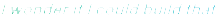

<!-- Header -->

<!-- 

 -->

  

 

I like building software that makes something tedious simpler or starts with *"."*

Most of my work gravitates toward reliable systems, automation, developer tools, and native applications, often with Python, TypeScript, or Swift. I care about software that behaves predictably, is understandable to maintain, and solves a real problem.

Sometimes I build practical systems. Sometimes I build weird little experiments just because they're interesting.

**Python · TypeScript · Swift · C# · SQL**  
FastAPI · PostgreSQL · SwiftUI · React · Docker

## Projects

| Project                                                                             | Status | What it does                                                                                                                                                           |
| ----------------------------------------------------------------------------------- | ------ | ---------------------------------------------------------------------------------------------------------------------------------------------------------------------- |
| [ScribeKit](https://github.com/quangshuynh/scribekit)                               | Active | Native macOS meeting transcription with selected-app audio capture, on-device speech recognition, durable Markdown output, and explicit recovery and failure handling. |
| [GitProfileLens](https://github.com/quangshuynh/gitprofilelens)                     | Active | Audits GitHub profiles and repositories for presentation, discoverability, and actionable improvements.                                                                |
| [Hymical Forms](https://github.com/hymical/forms)                                   | Active | Self-hostable form backend with durable webhook delivery, retries, idempotency, ownership fencing, and PostgreSQL-backed workers.                                      |
| [CaseNotes](https://github.com/quangshuynh/casenotes)                               | Active | Local-first native iOS notes app with Markdown, nested folders, version history, PencilKit drawings, export, and privacy-focused interface controls.                   |
| [Repo Radar](https://github.com/quangshuynh/repo-radar)                             | Active | Discovers and ranks repositories and open-source contribution opportunities based on developer interests.                                                              |
| [Business Data Automation](https://github.com/quangshuynh/business-data-automation) | v1.0   | Validates business data, quarantines invalid records, reconciles payments, and exposes results through FastAPI.                                                        |

|  |  |  |
